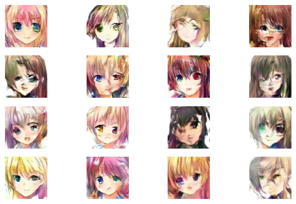
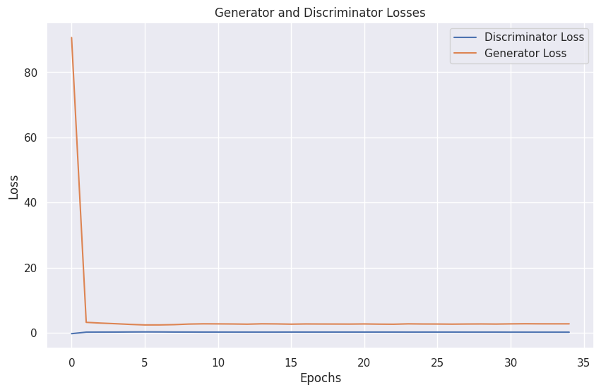

# Generating fake images using GAN

This project leverages the power of Generative Adversarial Networks (GANs) to generate realistic-looking fake images. GANs are a class of deep learning models where a generator network creates data, and a discriminator network evaluates the authenticity of that data. These networks are trained in a competitive manner, leading to the generation of high-quality synthetic data.

## Data Source:

```bash
https://www.kaggle.com/datasets/splcher/animefacedataset
```
## Key Features
GAN Architecture: The project implements a GAN architecture consisting of a generator and a discriminator.

Training Process: The networks are trained in an adversarial fashion, refining the generator's ability to create increasingly realistic images.

Flexibility: The code is adaptable to different datasets and image types, allowing users to generate fake images in various domains.

## Steps:
    1. Normalizing the input image
    2. Build and Instantiate the Generator function
    3. Build and Instantiate the Discriminator
    4. Define and build the GAN Model
    5. Train and Fit the GAN Model
    7. Generate the fake images






